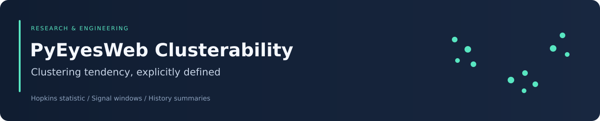

<div align="center">



# PyEyesWeb Clusterability

### Inspectable clustering-tendency estimates for arrays and signal windows


[Overview](#overview) · [Method](#hopkins-implementation) · [Setup](#setup-and-dependencies) · [API](#api-and-examples) · [Limits](#validation-and-limitations)

</div>

## Overview

This component estimates clustering tendency using a Hopkins-style nearest-neighbor statistic. It supports direct array assessment and full sliding-window analysis, plus a bounded history of computed scores.

It answers an exploratory question about spatial structure in a feature space. It does not perform clustering, choose the number of clusters, detect a clinical condition, or prove that a particular clustering algorithm is appropriate.

| Source | Role |
|---|---|
| [Clusterability.py](Clusterability.py) | Analyzer, interpretation thresholds, history summaries, and static helper |
| [test_clusterability.py](test_clusterability.py) | Pytest cases and local mock classes |
| [window_demo_test.py](window_demo_test.py) | Window-oriented demonstration script |

The source is a root-level module, not an installable standalone PyEyesWeb package.

## Hopkins implementation

For $m$ sampled observations, let $u_i$ be the distance to the nearest other data point and $w_i$ the nearest-data distance from a uniformly generated point inside the axis-aligned data bounds. The implementation computes

$$
H=\frac{\sum_{i=1}^{m}w_i}{\sum_{i=1}^{m}u_i+\sum_{i=1}^{m}w_i}.
$$

Distances are unpowered Euclidean distances. This convention should be stated when comparing results with implementations using distance powers or the complementary ratio.

The sample count is `min(max(2, int(sample_fraction * n)), n // 2)`. Real points are selected without replacement. The second nearest neighbor excludes the sampled observation itself; generated points use the first neighbor.

| Score interval | Exact source label |
|---|---|
| $H>0.75$ | `STRONG CLUSTERING` |
| $0.6<H\le0.75$ | `MODERATE CLUSTERING` |
| $0.5<H\le0.6$ | `WEAK CLUSTERING` |
| $0.3<H\le0.5$ | `RANDOM DISTRIBUTION` |
| $H\le0.3$ | `UNIFORM DISTRIBUTION` |

These are operational thresholds, not calibrated significance tests. In particular, the last label describes the module's low-score convention and should not be confused with the uniform random reference used to generate comparison points.

If **any** feature has zero range, the routine returns 0.5. It also returns 0.5 when the distance denominator is zero.

## Setup and dependencies

```bash
git clone https://github.com/Foysal-A-Al/PyEyesWeb_Clusterability.git
cd PyEyesWeb_Clusterability
python -m venv .venv
```

Activate with `source .venv/bin/activate` on Linux/macOS or `.venv\Scripts\Activate.ps1` in Windows PowerShell, then install:

```bash
python -m pip install numpy scikit-learn
```

A compatible upstream PyEyesWeb installation or checkout must also supply:

```python
from pyeyesweb.data_models.sliding_window import SlidingWindow
from pyeyesweb.data_models.thread_safe_buffer import ThreadSafeHistoryBuffer
from pyeyesweb.utils.validators import validate_integer, validate_boolean, validate_numeric
```

Those imports are required even for the static convenience function. This repository does not include these upstream modules, packaging metadata, or a verified Python-version matrix.

## API and examples

After the upstream dependencies are available, run from the repository root:

```python
import numpy as np
from Clusterability import Clusterability, assess_clusterability

rng = np.random.default_rng(42)
data = np.vstack([
    rng.normal(0, 0.3, (100, 2)),
    rng.normal(4, 0.3, (100, 2)),
])

result = assess_clusterability(data, sample_fraction=0.2, random_state=42)
print(result)
```

The example shows the API; a fixed numerical score is not asserted without a recorded environment.

### Constructor

```python
analyzer = Clusterability(
    sensitivity=100,
    output_interpretation=True,
    sample_fraction=0.1,
    random_state=42,
)
```

| Parameter | Meaning |
|---|---|
| `sensitivity` | History capacity, 1–10,000; not a significance or sensitivity threshold |
| `output_interpretation` | Enable categorical labels |
| `sample_fraction` | Sampling fraction, 0.01–0.5 |
| `random_state` | Nonnegative integer or `None` |

The static helper defaults to a sample fraction of 0.2, whereas the class defaults to 0.1.

### Computation contracts

| Method | Behavior |
|---|---|
| `compute_hopkins_statistic(data)` | Direct float result; requires a 2D array with at least 10 rows and one feature |
| `compute_clusterability(window)` | Dictionary with score, interpretation, observation count, and feature dimension |
| `analyzer(window)` | Same dictionary, with terminal output when the score is available |
| `get_history()` | Array of successfully appended window scores |
| `get_temporal_statistics()` | Mean, population standard deviation, linear trend, coefficient of variation, and history length |
| `reset_history()` | Clear stored window scores |

Direct `compute_hopkins_statistic` calls do not append to history. The static helper creates a new analyzer for each call.

For a non-full window or fewer than 10 observations, the window API returns a `NaN` score and no interpretation. Its `sample_size` field reports **observation count**, not the number of sampled neighbors. The non-full path accesses `window._n_columns`, and the window must expose `is_full()` and `to_array()`.

An exception inside the guarded calculation returns score 0.5 with `COMPUTATION ERROR` when labels are enabled. Do not interpret that fallback as evidence of randomness. When interpretations are disabled, this error status is not separately exposed.

## History interpretation

With at least two history entries, the module reports a least-squares slope against call index and `stability = std / mean`. Despite the field name, this is a coefficient of variation: lower values indicate less relative variation. The trend has no physical time unit because timestamps are ignored.

Fewer than two entries produce `NaN` summaries and the current history length.

## Validation and limitations

The tests define local mock dependencies but do not replace the module's imported `pyeyesweb` dependencies. An upstream environment is still required. No passing test-suite or real-time integration result is claimed for this documentation update.

After preparing that environment:

```bash
python -m pip install pytest
python -m pytest test_clusterability.py -v
```

Record the dependency versions and review stochastic assertions before interpreting failures.

Important limits include feature-scale sensitivity, axis-aligned reference sampling, high-dimensional distance behavior, duplicate observations, and a lack of explicit finite-value validation. Setting `random_state` resets NumPy's global random seed on every calculation, which can affect unrelated computations.

For reproducible research, record preprocessing, feature definitions, window length, sampling fraction, seed, dependency versions, and repeated-estimate variability. A single score should not replace downstream cluster validation.

## Attribution and licensing

The previous repository documentation records **Copyright: University of Genoa, Italy**. That notice is preserved here. No license file is included; copyright attribution alone is not a redistribution license.

Maintained by [Abdullah Al Foysal](https://github.com/Foysal-A-Al). Cite the repository URL and exact commit when using this implementation.
